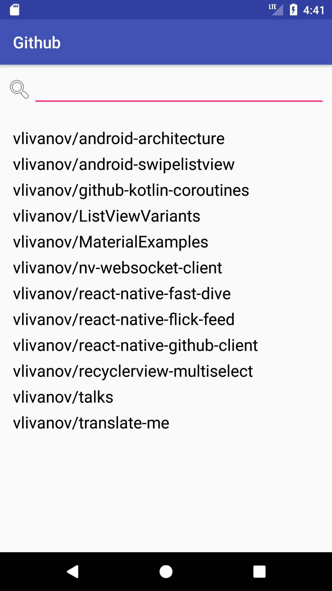
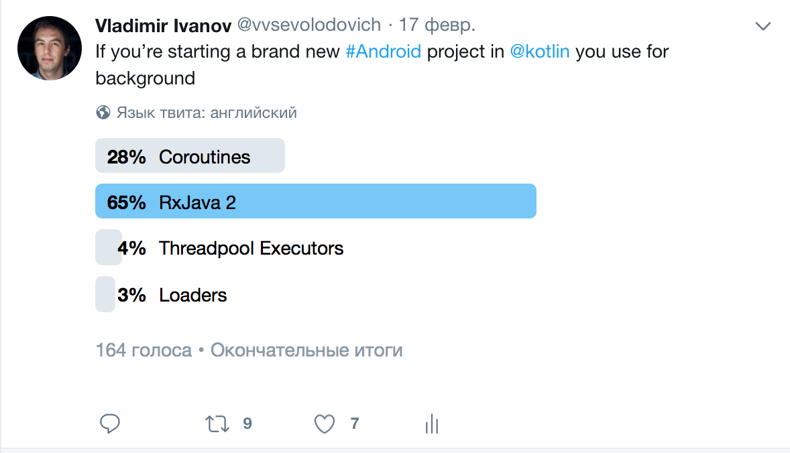
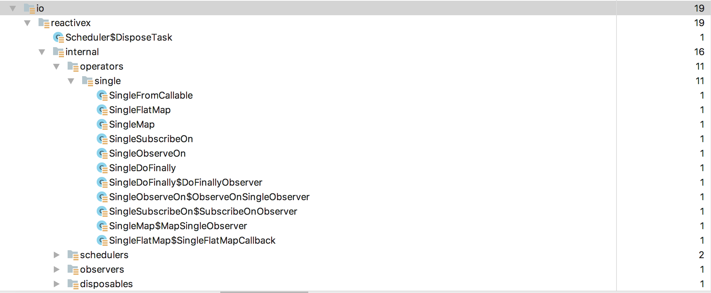

slidenumbers: true
autoscale: true
build-lists: true

## Forget RxJava: Introducing Kotlin couroutines

---

# About me

* Vladimir Ivanov - Lead Software Engineer in EPAM
* Android apps: > 15 published, > 7 years
* Wide expertise in Mobile

---

# .NET? 

---

# JS? 


---


---

# Async/await

---

```js
export const loginAsync = async (login, password) => {
    let auth = `Basic ${base64(login:password)}`
    try {
        let result = await fetch('https://api.github.com/user', auth)
        if (result.status === 200) {
            return { result.body }
        } else {
            return { error: `Failed to login with ${result.status}` }
        }
    } catch (error) {
        return { error: `Failed to login with ${error}` }
    }
}

```
---

# Easy to read?

---

# Kotlin can do this too!

---

# What do we do now?

---

# Github login application

* Login to github
* Get user’s repositories

---


---



---



---


---


# RxJava 2 implementation

```kotlin

interface ApiClientRx {

	fun login(auth: Authorization) 
		: Single<GithubUser>
	fun getRepositories
		(reposUrl: String, auth: Authorization) 
		: Single<List<GithubRepository>>

}

```

---

# RxJava 2 implementation

```kotlin, [.highlight: 4, 7]

interface ApiClientRx {

	fun login(auth: Authorization) 
		: Single<GithubUser>
	fun getRepositories
		(reposUrl: String, auth: Authorization) 
		: Single<List<GithubRepository>>

}

```

---

# RxJava 2 implementation

```kotlin

	override fun login(auth: Authorization) 
		: Single<GithubUser?> = Single.fromCallable {
		val response = get("https://api.github.com/user", auth = auth)
		if (response.statusCode != 200) {
			throw RuntimeException("Incorrect login or password")
		}

		val jsonObject = response.jsonObject
		with(jsonObject) {
			return@with GithubUser(getString("login"), getInt("id"),
					getString("repos_url"), getString("name"))
		}
	}
```
---

# RxJava 2 implementation

```kotlin

	override fun getRepositories
		(repoUrl: String, authorization: Authorization)
		: Single<List<GithubRepository>> {

		return Single.fromCallable({
				toRepos(get(repoUrl, auth = authorization).jsonArray)
		})
	}
```
---

```kotlin
private fun attemptLoginRx() {
	showProgress(true)
	apiClient.login(auth)
			.flatMap { user -> apiClient.getRepositories(user.repos_url, auth) }
			.map { list -> list.map { it.full_name } }
			.subscribeOn(Schedulers.io())
			.observeOn(AndroidSchedulers.mainThread())
			.doFinally { showProgress(false) }
			.subscribe(
					{ list -> showRepositories(this@LoginActivity, list)    },
					{ error -> Log.e("TAG", "Failed to show repos", error) }
			)
}
```

---

```kotlin, [.highlight: 3, 6-7]

private fun attemptLoginRx() {
	showProgress(true)
	apiClient.login(auth)
			.flatMap { user -> apiClient.getRepositories(user.repos_url, auth) }
			.map { list -> list.map { it.full_name } }
			.subscribeOn(Schedulers.io())
			.observeOn(AndroidSchedulers.mainThread())
			.doFinally { showProgress(false) }
			.subscribe(
					{ list -> showRepositories(this@LoginActivity, list)    },
					{ error -> Log.e("TAG", "Failed to show repos", error) }
			)

}

```

---


```kotlin, [.highlight: 4-5]

private fun attemptLoginRx() {
	showProgress(true)
	apiClient.login(auth)
			.flatMap { user -> apiClient.getRepositories(user.repos_url, auth) }
			.map { list -> list.map { it.full_name } }
			.subscribeOn(Schedulers.io())
			.observeOn(AndroidSchedulers.mainThread())
			.doFinally { showProgress(false) }
			.subscribe(
					{ list -> showRepositories(this@LoginActivity, list)    },
					{ error -> Log.e("TAG", "Failed to show repos", error) }
			)

}
```

---

```kotlin, [.highlight: 9-18]

private fun attemptLoginRx() {
	showProgress(true)
	apiClient.login(auth)
			.flatMap { user -> apiClient.getRepositories(user.repos_url, auth) }
			.map { list -> list.map { it.full_name } }
			.subscribeOn(Schedulers.io())
			.observeOn(AndroidSchedulers.mainThread())
			.doFinally { showProgress(false) }
			.subscribe(
					{ list -> showRepositories(this@LoginActivity, list)    },
					{ error -> Log.e("TAG", "Failed to show repos", error) }
			)
}

```

---

# Problems?

---

# Problems?

* A lot of intermediate objects created under the hood
* Unrelated stackstrace
* The learning curve for new devs is steppy

---



---

```kotlin

// new SingleFlatMap()
val flatMap = apiClient.login(auth)
		.flatMap { apiClient.getRepositories(it.repos_url, auth) }
// new SingleMap
val map = flatMap
		.map { list -> list.map { it.full_name } }
// new SingleSubscribeOn
val subscribeOn = map
		.subscribeOn(Schedulers.io())
// new SingleObserveOn
val observeOn = subscribeOn
		.observeOn(AndroidSchedulers.mainThread())
// new SingleDoFinally
val doFinally = observeOn
		.doFinally { showProgress(false) }
// new ConsumerSingleObserver
val subscribe = doFinally
		.subscribe(
				{ list -> showRepositories(this@LoginActivity, list) },
				{ error -> Log.e("TAG", "Failed to show repos", error) }
		)
	}

```

---

```kotlin
   
at com.epam.talks.github.model.ApiClientRx$ApiClientRxImpl$login$1.call(ApiClientRx.kt:16)
   at io.reactivex.internal.operators.single.SingleFromCallable.subscribeActual(SingleFromCallable.java:44)
   at io.reactivex.Single.subscribe(Single.java:3096)
   at io.reactivex.internal.operators.single.SingleFlatMap.subscribeActual(SingleFlatMap.java:36)
   at io.reactivex.Single.subscribe(Single.java:3096)
   at io.reactivex.internal.operators.single.SingleMap.subscribeActual(SingleMap.java:34)
   at io.reactivex.Single.subscribe(Single.java:3096)
   at io.reactivex.internal.operators.single.SingleSubscribeOn$SubscribeOnObserver.run(SingleSubscribeOn.java:89)
   at io.reactivex.Scheduler$DisposeTask.run(Scheduler.java:463)
   at io.reactivex.internal.schedulers.ScheduledRunnable.run(ScheduledRunnable.java:66)
   at io.reactivex.internal.schedulers.ScheduledRunnable.call(ScheduledRunnable.java:57)
   at java.util.concurrent.FutureTask.run(FutureTask.java:266)
   at java.util.concurrent.ScheduledThreadPoolExecutor$ScheduledFutureTask.run(ScheduledThreadPoolExecutor.java:301)
   at java.util.concurrent.ThreadPoolExecutor.runWorker(ThreadPoolExecutor.java:1162)
   at java.util.concurrent.ThreadPoolExecutor$Worker.run(ThreadPoolExecutor.java:636)
   at java.lang.Thread.run(Thread.java:764)
	
```

---


# Let’s see if Kotlin coroutines can help here


---

# Coroutines implementation

```kotlin

interface ApiClient {

	fun login(auth: Authorization) 
		: Deferred<GithubUser>
	fun getRepositories
		(reposUrl: String, auth: Authorization) 
		: Deferred<List<GithubRepository>>

}

```


---

# Coroutines implementation

```kotlin, [.highlight: 4,7]

interface ApiClient {

	fun login(auth: Authorization) 
		: Deferred<GithubUser>
	fun getRepositories
		(reposUrl: String, auth: Authorization) 
		: Deferred<List<GithubRepository>>

}

```

---

# Deferred is Future


---


---

# Deferred is Future

* Non-blocking
* Cancellable

---

```kotlin

	private fun attemptLogin() {
		val login = email.text.toString()
		val pass = password.text.toString()
		launch(UI) {
			showProgress(true)
			val auth = BasicAuthorization(login, pass)
			try {
				val userInfo = login(auth).await()
				val repoUrl = userInfo!!.repos_url
				val list = getRepositories(repoUrl, auth).await()
				showRepositories(this@LoginActivity, list!!.map { it -> it.full_name })
			} catch (e: RuntimeException) {
				Toast.makeText(this@LoginActivity, e.message, LENGTH_LONG).show()
			} finally {
				showProgress(false)
			}
		}
	}


```
---

# What about stacktraces?

---

```kotlin
at com.epam.talks.github.model.ApiClient$ApiClientImpl$login$1.doResume(ApiClient.kt:27)
   at kotlin.coroutines.experimental.jvm.internal.CoroutineImpl.resume(CoroutineImpl.kt:54)
   at kotlinx.coroutines.experimental.DispatchedTask$DefaultImpls.run(Dispatched.kt:161)
   at kotlinx.coroutines.experimental.DispatchedContinuation.run(Dispatched.kt:25)
   at java.util.concurrent.ForkJoinTask$RunnableExecuteAction.exec(ForkJoinTask.java:1412)
   at java.util.concurrent.ForkJoinTask.doExec(ForkJoinTask.java:285)
   at java.util.concurrent.ForkJoinPool$WorkQueue.runTask(ForkJoinPool.java:1152)
   at java.util.concurrent.ForkJoinPool.scan(ForkJoinPool.java:1990)
   at java.util.concurrent.ForkJoinPool.runWorker(ForkJoinPool.java:1938)
   at java.util.concurrent.ForkJoinWorkerThread.run(ForkJoinWorkerThread.java:157)
```

---


---


# Easy to read(as js)

* Code is async, but written as sync
* Error handling like for sync code(try-catch-finally)
* Several async calls will look sequantial
* Easy to write and understand by junior engineers

---

# Sync-styled

```kotlin, [.highlight: 6, 12, 10, 14]

	private fun attemptLogin() {
		…
		launch(UI) {
			val auth = BasicAuthorization(login, pass)
			try {
				showProgress(true)
				val userInfo = login(auth).await()
				val repoUrl = userInfo!!.repos_url
				val list = getRepositories(repoUrl, auth).await()
				showRepositories(this@LoginActivity, list!!.map { it -> it.full_name })
			} catch (e: RuntimeException) {
				Toast.makeText(this@LoginActivity, e.message, LENGTH_LONG).show()
			} finally {
				showProgress(false)
			}
		}
	}


```

---

## Error handling using language(not library methods)

```kotlin, [.highlight: 5,11-15]

	private fun attemptLogin() {
		…
		launch(UI) {
			val auth = BasicAuthorization(login, pass)
			try {
				showProgress(true)
				val userInfo = login(auth).await()
				val repoUrl = userInfo!!.repos_url
				val list = getRepositories(repoUrl, auth).await()
				showRepositories(this@LoginActivity, list!!.map { it -> it.full_name })
			} catch (e: RuntimeException) {
				Toast.makeText(this@LoginActivity, e.message, LENGTH_LONG).show()
			} finally {
				showProgress(false)
			}
		}
	}


```
---

## Several async calls look sequential

```kotlin, [.highlight: 5,7,8]
launch(UI) {
	showProgress(true)
	val auth = BasicAuthorization(login, pass)
	try {
		val userInfo = login(auth).await()
		val repoUrl = userInfo!!.repos_url
		val repos = getRepositories(repoUrl, auth).await()
		val pullRequests = getPullRequests(repos!![0], auth).await()
		showRepositories(this@LoginActivity, repos!!.map { it -> it.full_name })
	} catch (e: RuntimeException) {
		Toast.makeText(this@LoginActivity, e.message, LENGTH_LONG).show()
	} finally {
		showProgress(false)
	}
}
```
---

# Async functions

```kotlin
override fun login(auth: Authorization) : Deferred<GithubUser?> = async {
	val response = get("https://api.github.com/user", auth = auth)
	if (response.statusCode != 200) {
		throw RuntimeException("Incorrect login or password")
	}

	val jsonObject = response.jsonObject
	with (jsonObject) {
		return@async GithubUser(getString("login"), getInt("id"),
				getString("repos_url"), getString("name"))
	}
}
```
---

# Async functions

```kotlin
override fun login(auth: Authorization) 
	: Deferred<GithubUser?> = async {
		…
        return@async GithubUser(…)
}
```

---

# Coroutine builders

```kotlin
launch
async
runBlocking

```

---

# Async returns Deferred<T>

```kotlin

public actual interface Deferred<out T> : Job {
}

```

---

## Await - extension function

---

## Await - extension function

* Is like Future.get() but suspends instead of blocking

---

# Suspension

---


---


---


---

# Suspending

* means pause of executing
* which means ability to resume
* But suspend may happen only in predefined places
* When calling functions with ```suspend``` modifier!


---

# Where our suspend?


---

```kotlin

public expect fun <T> async(
    context: CoroutineContext = DefaultDispatcher,
    start: CoroutineStart = CoroutineStart.DEFAULT,
    parent: Job? = null,
    block: suspend CoroutineScope.() -> T
): Deferred<T>


```
---

```kotlin, [.highlight: 5]

public expect fun <T> async(
    context: CoroutineContext = DefaultDispatcher,
    start: CoroutineStart = CoroutineStart.DEFAULT,
    parent: Job? = null,
    block: suspend CoroutineScope.() -> T
): Deferred<T>


```
---

# Cancellation

---

# Thread.stop() 


---

# ~~Thread.stop()~~ 

---


## Cancellation is always cooperative


---


# RxJava 2

---
 
# Cancel in RxJava requires access to current subscription

---

# How to check if coroutine gets cancelled?

---

```kotlin
launch(UI) {
	showProgress(true)
	…
	try {
		val userInfo = apiClient.login(auth).await()
		if (!isActive) {
			return@launch
		}
	…
}
```
---

```kotlin, [.highlight: 6-9]
launch(UI) {
	showProgress(true)
	…
	try {
		val userInfo = apiClient.login(auth).await()
		if (!isActive) {
			return@launch
		}
	…
}
```

---

# Let’s write tests!

---

```kotlin

	@Test
	fun login() {
		val apiClientImpl = ApiClientRx.ApiClientRxImpl()
		val genericResponse = mockLoginResponse()

		staticMockk("khttp.KHttp").use {
			every { get("https://api.github.com/user", auth = any()) } returns genericResponse

			val githubUser =
					apiClientImpl
							.login(BasicAuthorization("login", "pass"))

			githubUser.subscribe({ githubUser ->
				Assert.assertNotNull(githubUser)
				Assert.assertEquals("name", githubUser.name)
				Assert.assertEquals("url", githubUser.repos_url)
			})

		}
	}
```
---

```kotlin

	@Test
	fun login() {
		…

			val githubUser =
					apiClientImpl
							.login(BasicAuthorization("login", "pass"))

			githubUser.subscribe({ githubUser ->
				Assert.assertNotNull(githubUser)
				Assert.assertEquals("name", githubUser.name)
				Assert.assertEquals("url", githubUser.repos_url)
			})

		…
	}
```

---

```kotlin
@Test
fun login() {
	val apiClientImpl = ApiClient.ApiClientImpl()
	val genericResponse = mockLoginResponse()

	staticMockk("khttp.KHttp").use {
		every { get("https://api.github.com/user", auth = any()) } returns genericResponse

		runBlocking {
			val githubUser =
					apiClientImpl
						.login(BasicAuthorization("login", "pass"))
						.await()

			assertNotNull(githubUser)
			assertEquals("name", githubUser.name)
			assertEquals("url", githubUser.repos_url)
		}
	}
}
```
---

```kotlin, [.highlight: 4,12]
@Test
fun login() {
…
	runBlocking {
		val githubUser =
			apiClientImpl
				.login(BasicAuthorization("login", "pass"))
				.await()

		
		assertEquals("name", githubUser.name)
	}
}
	
```
---

```kotlin, [.highlight: 4,12, 6-8]
@Test
fun login() {
…
	runBlocking {
		val githubUser =
			apiClientImpl
				.login(BasicAuthorization("login", "pass"))
				.await()

		
		assertEquals("name", githubUser.name)
	}
}
	
```

---

# So tests are pretty much the same


---


# What if Coroutines can simplify our interface even more?


---

``` kotlin
interface SuspendingApiClient {


suspend fun login(auth: Authorization) 
	: GithubUser
suspend fun getRepositories(reposUrl: String, auth: Authorization) 
	: List<GithubRepository>
suspend fun searchRepositories(searchQuery: String) 
	: List<GithubRepository>


}
```

---

``` kotlin
class SuspendingApiClientImpl : SuspendingApiClient {

	override suspend fun searchRepositories(query: String) 
			: List<GithubRepository> =
			get("https://api.github.com/search/repositories?q=${query}")
			.jsonObject
			.getJSONArray("items")
			.toRepos()
}
```
---

``` kotlin, [.highlight: 8, 10]
	private fun attemptLoginSuspending() {

		val apiClient = SuspendingApiClient.SuspendingApiClientImpl()
		launch(UI) {
			showProgress(true)
			val auth = BasicAuthorization(login, pass)
			try {
				val userInfo = async { apiClient.login(auth) }.await()
				val repoUrl = userInfo!!.repos_url
				val list = async { apiClient.getRepositories(repoUrl, auth) }.await()
				showRepositories(this@LoginActivity, list!!.map { it -> it.full_name })
			} catch (e: RuntimeException) {
				Toast.makeText(this@LoginActivity, e.message, LENGTH_LONG).show()
			} finally {
				showProgress(false)
			}
		}
	}
```

---

```kotlin
@Test
fun login() = runBlocking {
	val apiClientImpl = SuspendingApiClient.SuspendingApiClientImpl()
	val genericResponse = mockLoginResponse()

	staticMockk("khttp.KHttp").use {
		every { get("https://api.github.com/user", auth = any()) } returns genericResponse

		val githubUser =
				apiClientImpl
					.login(BasicAuthorization("login", "pass"))

		assertNotNull(githubUser)
		assertEquals("name", githubUser.name)
		assertEquals("url", githubUser.repos_url)
	}
}
```

---

```kotlin, [.highlight: 2, 8-15]
@Test
fun login() = runBlocking {
	val apiClientImpl = SuspendingApiClient.SuspendingApiClientImpl()
	val genericResponse = mockLoginResponse()

	staticMockk("khttp.KHttp").use {
		every { get("https://api.github.com/user", auth = any()) } returns genericResponse

		val githubUser =
				apiClientImpl
					.login(BasicAuthorization("login", "pass"))

		assertNotNull(githubUser)
		assertEquals("name", githubUser.name)
		assertEquals("url", githubUser.repos_url)
	}
}
```

---

# Short summary

* Short stacktrace
* Code is more explicit, therefore easier to read and understand
* Clean interfaces, clean tests

---

# Why Rx in the first place?

---


---

```kotlin

publishSubject
	.debounce(300, TimeUnit.MILLISECONDS)
	.distinctUntilChanged()
	.switchMap { 
		searchQuery -> apiClientRxImpl.searchRepositories(searchQuery) 
	}
	.subscribeOn(Schedulers.io())
	.observeOn(AndroidSchedulers.mainThread())
	.subscribe({
		repos.adapter = ReposAdapter(
			it.map { it.full_name },
			this@RepositoriesActivity)
	})

```
---

```kotlin, [.highlight: 5]

publishSubject
	.debounce(300, TimeUnit.MILLISECONDS)
	.distinctUntilChanged()
	.switchMap { 
		searchQuery -> apiClientRxImpl.searchRepositories(searchQuery) 
	}
	.subscribeOn(Schedulers.io())
	.observeOn(AndroidSchedulers.mainThread())
	.subscribe({
		repos.adapter = ReposAdapter(
			it.map { it.full_name },
			this@RepositoriesActivity)
	})

```
---

```kotlin, [.highlight: 9-13]

publishSubject
	.debounce(300, TimeUnit.MILLISECONDS)
	.distinctUntilChanged()
	.switchMap { 
		searchQuery -> apiClientRxImpl.searchRepositories(searchQuery) 
	}
	.subscribeOn(Schedulers.io())
	.observeOn(AndroidSchedulers.mainThread())
	.subscribe({
		repos.adapter = ReposAdapter(
			it.map { it.full_name },
			this@RepositoriesActivity)
	})

```
---

# What’s really awesome here?
---

```kotlin, [.highlight: 2-4]

publishSubject
	.debounce(300, TimeUnit.MILLISECONDS)
	.distinctUntilChanged()
	.switchMap { 
		searchQuery -> apiClientRxImpl.searchRepositories(searchQuery) 
	}
	.subscribeOn(Schedulers.io())
	.observeOn(AndroidSchedulers.mainThread())
	.subscribe({
		repos.adapter = ReposAdapter(
			it.map { it.full_name },
			this@RepositoriesActivity)
	})

```

---

# We can do the same or better in Kotlin Coroutines… 

---

# …with channels

---

```kotlin

launch(UI) {
	broadcast.consumeEach {
		delay(300)
		val foundRepositories = 
				apiClient.searchRepositories(it).await()
		repos.adapter = ReposAdapter(
							foundRepositories.map { it.full_name },
							this@RepositoriesActivity
		)
	}
}

```
---

```kotlin, [.highlight: 4,5]

launch(UI) {
	broadcast.consumeEach {
		delay(300)
		val foundRepositories = 
				apiClient.searchRepositories(it).await()
		repos.adapter = ReposAdapter(
							foundRepositories.map { it.full_name },
							this@RepositoriesActivity
		)
	}
}

```
---

```kotlin, [.highlight: 6-9]

launch(UI) {
	broadcast.consumeEach {
		delay(300)
		val foundRepositories = 
				apiClient.searchRepositories(it).await()
		repos.adapter = ReposAdapter(
							foundRepositories.map { it.full_name },
							this@RepositoriesActivity
		)
	}
}

```
---

# What is broadcast? 

---

```kotlin, [.highlight: 2]

launch(UI) {
	broadcast.consumeEach {
		delay(300)
		val foundRepositories = 
				apiClient.searchRepositories(it).await()
		repos.adapter = ReposAdapter(
							foundRepositories.map { it.full_name },
							this@RepositoriesActivity
		)
	}
}

```
---

```kotlin

val broadcast = ConflatedBroadcastChannel<String>()


```
---

```kotlin

val broadcast = ConflatedBroadcastChannel<String>()

searchQuery.addTextChangedListener(object: TextWatcher {

	override fun afterTextChanged(text: Editable?) {
			broadcast.offer(text.toString())
		}
	})
}

```

---

# Questions


---

* What are channels?
* What is a BroadcastChannel?
* What is a conflated channel?

---

# What are channels?

---

## Channel is a blocking queue 

---


---

| BlockingQueue | Channel |
| --- | --- |
| put | send | 
| take | receive | 

---

```kotlin

public suspend fun send(element: E)

public suspend fun receive(): E

```

---

# What is a BroadcastChannel?

---

# BroadcastChannel is Subject

---


---

| Subject | BroadcastChannel |
| --- | --- |
| `Subject<T> extends Observable<T> implements Observer<T>` | `BroadcastChannel<E> : SendChannel<E>` | 
| - | `public fun openSubscription(): SubscriptionReceiveChannel<E>` |

---

# What is a conflated channel?

---

## ConflatedBroadcastChannel is a BroadcastChannel…

---

## …but previuosly sent elements are lost

---

# Not quite persuasively…

---

# What if I still need Rx?

---

# What if I still need Rx?[^1]

[^1]: And you actually will, because you can’t compare a language feature with a shittone library

---

# Kotlin coroutines actually supports Rx…

---

# with kotlinx-coroutines-rx2 

---

| Name	| Result	| Scope	| Description | 
| --- | --- | --- | --- |
| rxCompletable	| Completable	| CoroutineScope	| Cold completable that starts coroutine on subscribe | 
| rxMaybe	| Maybe	| CoroutineScope | 	Cold maybe that starts coroutine on subscribe | 
| rxSingle	| Single	| CoroutineScope | Cold single that starts coroutine on subscribe | 
| rxObservable	| Observable	| ProducerScope	| Cold observable that starts coroutine on subscribe | 
| rxFlowable	| Flowable	| ProducerScope | 	Cold observable that starts coroutine on subscribe with backpressure support | 

---


| Name	| Description| 
| --- | --- |
| Job.asCompletable	| Converts job to hot completable| 
| Deferred.asSingle	| Converts deferred value to hot single| 
| ReceiveChannel.asObservable	| Converts streaming channel to hot observable| 
| Scheduler.asCoroutineDispatcher	| Converts scheduler to CoroutineDispatcher| 

---


# Links

* https://github.com/Kotlin/kotlinx.coroutines :computer:
* https://github.com/vlivanov/github-kotlin-coroutines :computer:
* https://twitter.com/vvsevolodovich :bird:
* https://medium.com/@dzigorium :pencil:


