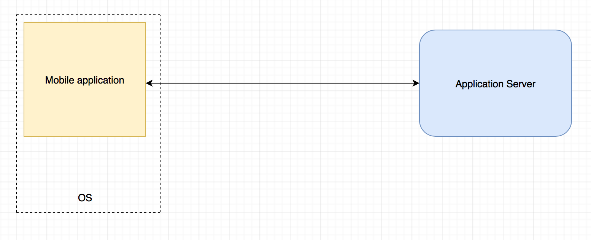
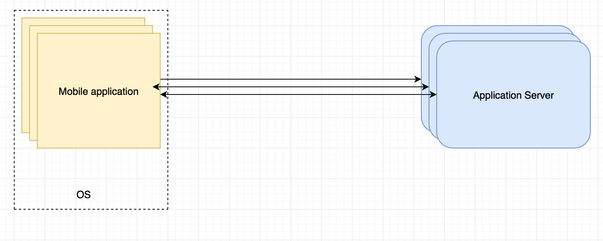
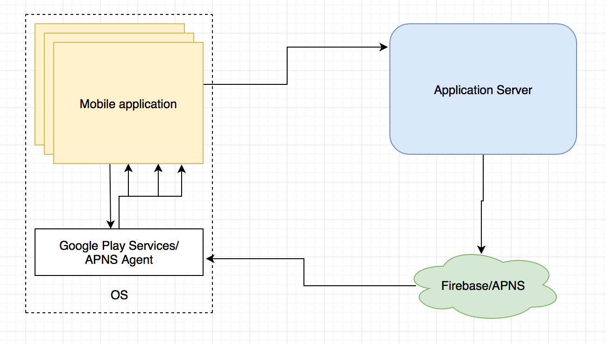
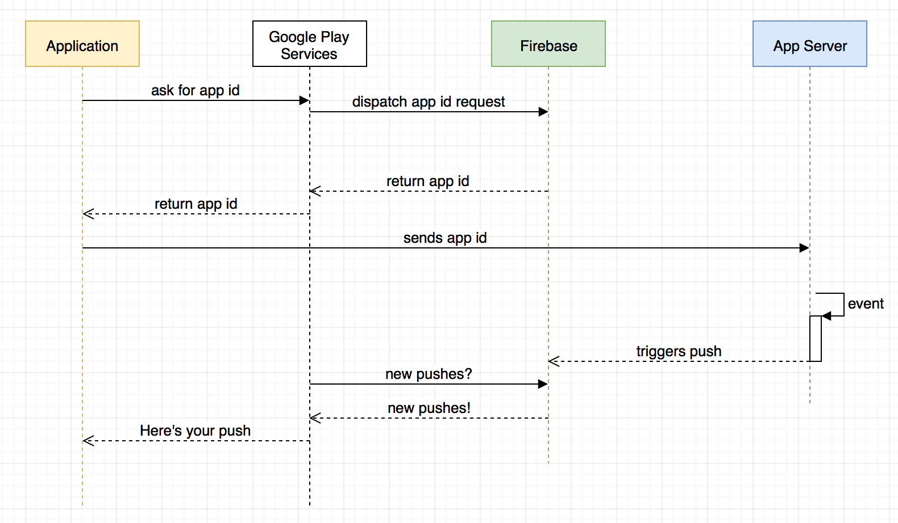

slidenumbers: true
autoscale: true
build-lists: true

# React Native - Push Notifications


---

# About me

* Vladimir Ivanov - Lead Software Engineer
* Primary Skill: Android
* React Native Experience > 1 year

---

# What are notifications?


---


---


---

# Notification purposes

* Sports scores and news right on their lock screen
* Utility messages like traffic, weather and ski snow reports
* Flight check in, change, and connection information

---

# Notification purposes

* Promoting products or offers to increase sales
* Improving customer experience
* Sending transactional receipts right away
* Driving users to other marketing channels, such as social networks

---


# Types of notifications

* Local
* Remote

---

# Local notifications

---

# Implement local notifications for Android

* Show/update/delete notification code
* Notification reaction
* Handling on js side

---

# Native module for publishing notifications

```kotlin

class NotificationsModule(reactContext: ReactApplicationContext?) 
	: ReactContextBaseJavaModule(reactContext) {

	val channelId = "com.rnmentoring.reactnative"
	lateinit var notificationManager: NotificationManager;

	override fun getName(): String {
		return "Notifications"
	}

}

```


---

# Native module for publishing notifications

```kotlin

	@ReactMethod
	public fun initModule() {
		notificationManager =
				reactApplicationContext.getSystemService(
						Context.NOTIFICATION_SERVICE) as NotificationManager

		createNotificationChannel(
				channelId,
				"Notifications for React Native",
				"The channel contains notifications from React Native js code")
	}


```


---

# Native module for publishing notifications

```kotlin

private fun createNotificationChannel(id: String, name: String,
										  description: String) 
{

	val importance = NotificationManager.IMPORTANCE_LOW
	val channel = NotificationChannel(id, name, importance)

	channel.description = description
	channel.enableVibration(true)

	notificationManager?.createNotificationChannel(channel)
}


```


---

# Native module for publishing notifications

```kotlin, [.highlight: 1-5, 11-15]

@ReactMethod
public fun showNotification(title: String, message: String, callback: Callback) {

	val notification = Notification.Builder(reactApplicationContext,
				channelId)
			.setContentTitle(title)
			.setContentText(message)
			.setSmallIcon(android.R.drawable.ic_dialog_info)
			.setChannelId(channelId)
			.setContentIntent(createPendingIntent())
			.build()

	val notificationId = 1;
	notificationManager?.notify(notificationId, notification)

	callback?.invoke(notificationId)
}


```
---

# Native module for publishing notifications

```kotlin, [.highlight: 6-10]

@ReactMethod
public fun showNotification(title: String, message: String, callback: Callback) {

	val notification = Notification.Builder(reactApplicationContext,
				channelId)
			.setContentTitle(title)
			.setContentText(message)
			.setSmallIcon(android.R.drawable.ic_dialog_info)
			.setChannelId(channelId)
			.setContentIntent(createPendingIntent())
			.build()

	val notificationId = 1;
	notificationManager?.notify(notificationId, notification)

	callback?.invoke(notificationId)
}


```
---

# Native module for publishing notifications

```kotlin, [.highlight: 16]

@ReactMethod
public fun showNotification(title: String, message: String, callback: Callback) {

	val notification = Notification.Builder(reactApplicationContext,
				channelId)
			.setContentTitle(title)
			.setContentText(message)
			.setSmallIcon(android.R.drawable.ic_dialog_info)
			.setChannelId(channelId)
			.setContentIntent(createPendingIntent())
			.build()

	val notificationId = 1;
	notificationManager?.notify(notificationId, notification)

	callback?.invoke(notificationId)
}


```


---

# Initing native modules

```js

componentWillMount() {
        const self = this;
        Notifications.initModule();
	...
}

```

---

# Showing notification

```xml

<Button 
	title={'Post a notification!'} 
	onPress={this.showNotification}
}/>


```

---

# Showing notification

```js, [.highlight : 1]
showNotification = () => {
	Notifications.showNotification(
	'Hello from RN', 
	'This is a greeting from js!', 
	() => {
        	self.notificationId = 1;
        })
}

```
---

# Showing notification

```js, [.highlight : 2]
showNotification = () => {
	Notifications.showNotification(
	'Hello from RN', 
	'This is a greeting from js!', 
	() => {
        	self.notificationId = 1;
        })
}

```
---

# Showing notification

```js, [.highlight : 3,4]
showNotification = () => {
	Notifications.showNotification(
	'Hello from RN', 
	'This is a greeting from js!', 
	() => {
        	self.notificationId = 1;
        })
}

```

---

# Showing notification

```js, [.highlight : 5-7]
showNotification = () => {
	Notifications.showNotification(
	'Hello from RN', 
	'This is a greeting from js!', 
	() => {
        	self.notificationId = 1;
        })
}

```

---

# Updating the notification

```kotlin, [.highlight: 1-4]
@ReactMethod
public fun updateNotification(id: kotlin.Int, title: String, message: String) {

	val notification = Notification.Builder(reactApplicationContext, channelId)
			.setContentTitle(title)
			.setContentText(message)
			.setSmallIcon(android.R.drawable.ic_dialog_info)
			.setChannelId(channelId)
			.build()

	notificationManager?.notify(id, notification)
}

```

---

# Updating the notification

```kotlin, [.highlight: 5,6]
@ReactMethod
public fun updateNotification(id: kotlin.Int, title: String, message: String) {

	val notification = Notification.Builder(reactApplicationContext, channelId)
			.setContentTitle(title)
			.setContentText(message)
			.setSmallIcon(android.R.drawable.ic_dialog_info)
			.setChannelId(channelId)
			.build()

	notificationManager?.notify(id, notification)
}

```

---

# Updating the notification

```kotlin, [.highlight: 9]
@ReactMethod
public fun updateNotification(id: kotlin.Int, title: String, message: String) {

	val notification = Notification.Builder(reactApplicationContext, channelId)
			.setContentTitle(title)
			.setContentText(message)
			.setSmallIcon(android.R.drawable.ic_dialog_info)
			.setChannelId(channelId)
			.build()

	notificationManager?.notify(id, notification)
}

```
---

# Updating the notification

```kotlin, [.highlight: 11]
@ReactMethod
public fun updateNotification(id: kotlin.Int, title: String, message: String) {

	val notification = Notification.Builder(reactApplicationContext, channelId)
			.setContentTitle(title)
			.setContentText(message)
			.setSmallIcon(android.R.drawable.ic_dialog_info)
			.setChannelId(channelId)
			.build()

	notificationManager?.notify(id, notification)
}

```

---

# Updating the notification

```kotlin
@ReactMethod
public fun removeNotification(id : kotlin.Int) {
	notificationManager?.cancel(id)
}

```


---

# Providing reaction to a notification

---


---

# Providing reaction to a notification

* Set an Intent to the notification
* Handle the intent inside Activity
* Notify javascript


---

# Set an Intent to the notification

```kotlin
private fun createPendingIntent() : PendingIntent {
	val resultIntent = Intent(reactApplicationContext, MainActivity::class.java)

	return PendingIntent.getActivity(
			reactApplicationContext,
			0,
			resultIntent,
			PendingIntent.FLAG_UPDATE_CURRENT
	)
}

```
---

# Set an Intent to the notification

```kotlin, [.highlight: 7]
		val notification = Notification.Builder(reactApplicationContext,
				channelId)
				.setContentTitle(title)
				.setContentText(message)
				.setSmallIcon(android.R.drawable.ic_dialog_info)
				.setChannelId(channelId)
				.setContentIntent(createPendingIntent())
				.build()

```
---

# Handle notification click

```kotlin, [.highlight: 1]

class MainActivity : ReactActivity() {

	override fun onNewIntent(intent: Intent) {
		super.onNewIntent(intent)
	}
}

```

---

# Handle notification click

```kotlin, [.highlight: 3,5-7]

class MainActivity : ReactActivity() {

	override fun onNewIntent(intent: Intent) {
		super.onNewIntent(intent)
		...
	}
}

```

---

# Handle notification click

```kotlin, [.highlight: 6]

class MainActivity : ReactActivity() {

	override fun onNewIntent(intent: Intent) {
		super.onNewIntent(intent)

		val reactNativeHost = (application as ReactApplication).reactNativeHost
		val mentoringReactNativeHost = reactNativeHost as MentoringReactNativeHost
		val notificationModule = mentoringReactNativeHost.getNotificationsPackage().notificationModule
		notificationModule.notifyNewIntent()
	}
}

```

---

# Handle notification click

```kotlin, [.highlight: 7]

class MainActivity : ReactActivity() {

	override fun onNewIntent(intent: Intent) {
		super.onNewIntent(intent)

		val reactNativeHost = (application as ReactApplication).reactNativeHost
		val mentoringReactNativeHost = reactNativeHost as MentoringReactNativeHost
		val notificationModule = mentoringReactNativeHost.getNotificationsPackage().notificationModule
		notificationModule.notifyNewIntent()
	}
}

```
---

# Handle notification click

```kotlin, [.highlight: 8,9]

class MainActivity : ReactActivity() {

	override fun onNewIntent(intent: Intent) {
		super.onNewIntent(intent)

		val reactNativeHost = (application as ReactApplication).reactNativeHost
		val mentoringReactNativeHost = reactNativeHost as MentoringReactNativeHost
		val notificationModule = mentoringReactNativeHost.getNotificationsPackage().notificationModule
		notificationModule.notifyNewIntent()
	}
}

```

---

# Notify js

```kotlin
public fun notifyNewIntent() {
	reactApplicationContext
			?.getJSModule(DeviceEventManagerModule.RCTDeviceEventEmitter::class.java)
			?.emit("notificationClicked", null)
}

```


---

# Notify js

```js
constructor(props) {
    super(props)
    this.state = { online: true, clicked : 0 };
}

componentWillMount() {
        emitter.addListener('notificationClicked', () => {
          self.setState({ clicked: self.state.clicked + 1 })
        })
}

```

---

# Notify js

```xml
<View style={styles.button}>
    <Text>{`Notification was clicked ${this.state.clicked} times`}</Text>
</View>

```

---


---

# Local notifications for iOS

---

# Local notifications for iOS

* Request the permissions
* Build native module
* Call from js

---

# Request the permissions

```objectivec
UNUserNotificationCenter *center = [UNUserNotificationCenter currentNotificationCenter];
[center requestAuthorizationWithOptions:
	(UNAuthorizationOptionBadge | UNAuthorizationOptionSound | UNAuthorizationOptionAlert)
    completionHandler:^(BOOL granted, NSError * _Nullable error) {
        if (!error) {
           NSLog(@"request authorization succeeded!");
        }
    }
];
```


---

# Build native module

```objectivec
#import "React/RCTEventEmitter.h"
#import <React/RCTBridgeModule.h>

@interface NotificationsModule : RCTEventEmitter

@end
```


---

# Build native module

```objectivec

RCT_EXPORT_METHOD(initModule)
{
  NSLog(@"[NotificationsModule] initModule");
}

```


---

# Build native module

```objectivec


RCT_EXPORT_METHOD(showNotification:(NSString*)title 
	andText:(NSString *)text 
	andCallback:(RCTResponseSenderBlock)block)
{
  [[NSOperationQueue mainQueue] addOperationWithBlock:^ {
    
    [self createAlarm:1 title:title text:text];
    NSArray* events = @[@"1"];
    block(@[[NSNull null], events]);
  }];

};
```

---

# Build native module

```objectivec, [.highlight: 1]

- (void)createAlarm:(int)id title:(NSString*) title text:(NSString *)text {
  
  UNMutableNotificationContent* content = [[UNMutableNotificationContent alloc] init];
  content.title = [NSString localizedUserNotificationStringForKey:title arguments:nil];
  content.body = [NSString localizedUserNotificationStringForKey:text
                                                       arguments:nil];
  content.sound = [UNNotificationSound defaultSound];
  
  UNTimeIntervalNotificationTrigger* trigger = [UNTimeIntervalNotificationTrigger
                                                triggerWithTimeInterval:5 repeats:NO];
  UNNotificationRequest* request = [UNNotificationRequest requestWithIdentifier:@“1”
                                                                        content:content trigger:trigger];
  
  UNUserNotificationCenter* center = [UNUserNotificationCenter currentNotificationCenter];
  [center addNotificationRequest:request withCompletionHandler:nil];

}
```
---

# Build native module

```objectivec, [.highlight: 3-7]

- (void)createAlarm:(int)id title:(NSString*) title text:(NSString *)text {
  
  UNMutableNotificationContent* content = [[UNMutableNotificationContent alloc] init];
  content.title = [NSString localizedUserNotificationStringForKey:title arguments:nil];
  content.body = [NSString localizedUserNotificationStringForKey:text
                                                       arguments:nil];
  content.sound = [UNNotificationSound defaultSound];
  
  UNTimeIntervalNotificationTrigger* trigger = [UNTimeIntervalNotificationTrigger
                                                triggerWithTimeInterval:5 repeats:NO];
  UNNotificationRequest* request = [UNNotificationRequest requestWithIdentifier:@“1”
                                                                        content:content trigger:trigger];
  
  UNUserNotificationCenter* center = [UNUserNotificationCenter currentNotificationCenter];
  [center addNotificationRequest:request withCompletionHandler:nil];

}
```
---

# Build native module

```objectivec, [.highlight: 8-12]

- (void)createAlarm:(int)id title:(NSString*) title text:(NSString *)text {
  
  UNMutableNotificationContent* content = [[UNMutableNotificationContent alloc] init];
  content.title = [NSString localizedUserNotificationStringForKey:title arguments:nil];
  content.body = [NSString localizedUserNotificationStringForKey:text
                                                       arguments:nil];
  content.sound = [UNNotificationSound defaultSound];
  
  UNTimeIntervalNotificationTrigger* trigger = [UNTimeIntervalNotificationTrigger
                                                triggerWithTimeInterval:5 repeats:NO];
  UNNotificationRequest* request = [UNNotificationRequest requestWithIdentifier:@“1”
                                                                        content:content trigger:trigger];
  
  UNUserNotificationCenter* center = [UNUserNotificationCenter currentNotificationCenter];
  [center addNotificationRequest:request withCompletionHandler:nil];

}
```
---

# Build native module

```objectivec, [.highlight: 13,14,15]

- (void)createAlarm:(int)id title:(NSString*) title text:(NSString *)text {
  
  UNMutableNotificationContent* content = [[UNMutableNotificationContent alloc] init];
  content.title = [NSString localizedUserNotificationStringForKey:title arguments:nil];
  content.body = [NSString localizedUserNotificationStringForKey:text
                                                       arguments:nil];
  content.sound = [UNNotificationSound defaultSound];
  
  UNTimeIntervalNotificationTrigger* trigger = [UNTimeIntervalNotificationTrigger
                                                triggerWithTimeInterval:5 repeats:NO];
  UNNotificationRequest* request = [UNNotificationRequest requestWithIdentifier:@“1”
                                                                        content:content trigger:trigger];
  
  UNUserNotificationCenter* center = [UNUserNotificationCenter currentNotificationCenter];
  [center addNotificationRequest:request withCompletionHandler:nil];

}
```
---

# Build native module

```objectivec

- (void)cancel:(int)id {
  UNUserNotificationCenter* center = [UNUserNotificationCenter currentNotificationCenter];
  [center removeDeliveredNotificationsWithIdentifiers:@[@"1"]];
}
```

---

# Already existing solutions

https://github.com/wumke/react-native-local-notifications

---

# Already existing solutions

```js

import RNLocalNotifications from 'react-native-local-notifications';

RNLocalNotifications.createNotification(1, 'Some text', '2017-01-02 12:30', 'default');

RNLocalNotifications.updateNotification(1, 'Some modifications to text', '2017-01-02 12:35', 'silence');

RNLocalNotifications. deleteNotification(1);

```

---

# Remote notifications: Original problems

---

# Remote notifications: Original problems

* Need to sustain sort of permanent connection to monitor for changes
* So you introduce socket or keep-alive

---



---



---

# What happens?

---


---

# What is the solution?

* Make at most one changes-monitoring connection
* Optimize it at system level


---



---

# 3 step mechanism

* Obtain gcm/sns id
* Register the id on the server
* Receive the push

---




---


---


---


---

# How to implement?

---

# How to implement?

* Configure backend
* Add support in the mobile application
* Implement the push handling

---

# Existing solutions

https://github.com/zo0r/react-native-push-notification

---

# Existing solutions

```js

var PushNotification = require('react-native-push-notification');

PushNotification.configure({

    // (optional) Called when Token is generated (iOS and Android)
    onRegister: function(token) {
        console.log( 'TOKEN:', token );
    },

    // (required) Called when a remote or local notification is opened or received
    onNotification: function(notification) {
        console.log( 'NOTIFICATION:', notification );
    },

}

```

---

# Send the id

```js

PushNotification.configure({

    
    onRegister: function(token) {
        ApiClient.sendTokenToServer(token);
    },

}

```


---

# Handling the notification

```js

PushNotification.configure({
   
    // (required) Called when a remote or local notification is opened or received
    onNotification: function(notification) {
        console.log( 'NOTIFICATION:', notification );
    },

}

```

---

# Handling the notification

```js

{
    foreground: false, 
    userInteraction: true,
    message: 'My Notification Message',
    data: {}, // The push data
}
```


---

# Handling the notification

```js

PushNotification.configure({
   
 onNotification = (notification) => {
    if (notification.data.message) {
	  getStore().dispatch(openChat(notification.data.message.chatId))
    }	
 },

}
```


---

# Other useful libraries

https://github.com/evollu/react-native-fcm


