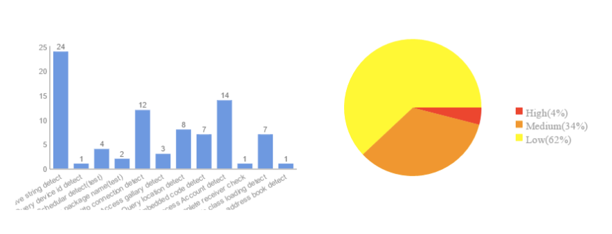

slidenumbers: true
autoscale: true
build-lists: true

# Void of the Legacy

---

#About me

* Vladimir Ivanov - Lead software engineer
* More than 6 years in Android development
* Wide interest in Mobile technologies
* Happy father of a wonderful son

——-

# Что такое legacy?

* ~~То, что написано не нами~~
* Архитектуры нет или плохая архитектура
* Слабоструктурированный или слишком запутанный код
* WTF/ в час превышает 9000

——-

# Как это Legacy мерять?

* $$L$$ = T$$ * $$H [^1]
* Но как определить T?

[^1]: 
 	T - время техдолга в часах, H - часовая ставка разработчика

——-

# Что есть тех.долг? 

* Ошибки и уязвимости
* Сопровождаемость
* Дублирование кода
* Процент покрытия тестами

———

# Тулы для оценки 

SonarQube

——

———

# Тулы для оценки 

SonarQube
MobSF/Akana/Whatever Security Analysis tool

——

——-

# Тулы для оценки 

SonarQube
MobSF/Akana/Whatever Security Analysis tool
Architecture analysis tool

——

# Тулы для оценки 

SonarQube
MobSF/Akana/Whatever Security Analysis tool
~~Architecture analysis tool~~

——

# Что такое архитектура? 

* Архитектура - это набор структур, состоящих из компонентов и связей между ними, а также свойств одних и вторых, определяющих свойства системы [^2]

[^2]: 
 	Software Architecture in Practice, 3rd Edition, Bass, Clements, Kazman, Addison-Wesley

——-

# Что это к чертям значит? 

* Архитектура - ключ к свойствам системы, которые важны пользователю
* Или владелец продукта думает, что они важны
* То есть плохих или хороших архитектур не бывает, они либо подходят, либо не подходят под требования

——-

# Оценка архитектуры 

* Если вы проверяете технологию, об архитектуре можно не думать
* Если вы пишите скрипт для отсылки почты по списку адресов, об архитектуре можно не думать
* Во всех остальных случаях, про архитектуру надо думать

———

# Какими свойствами должно обладать наше Legacy, чтобы быть конфеткой?

* Быть расширяемым
* Быть тестируемым
* Быть производительным
* Быть локализуемым
* Работать оффлайн

——-

# Какая архитектура отвечает этим требованиям? 

——-

# Какая архитектура отвечает этим требованиям? 

* Clean architecture

——-

——-

——-

# Какая архитектура отвечает этим требованиям? 

* Clean architecture
* Google Android architecture

——-

——-

# Что общего?

* Каждый слой знает только про один слой под ним

* Пруфлинк:

В строго поделенных на слои системах, слою позволено использовать только слой, расположенный непосредственно под ним [^3]

[^3]: 
 	Software Architecture in Practice, 3rd Edition, Bass, Clements, Kazman, Addison-Wesley

——-

——-

Составляем план действий

——-

# Выделение отдельного слоя

1. Отдельный модуль
2. Покрытый на 100% тестами
3. Внедряемый в приложение

——

# Интеграция в приложение

1. 1 юзкейс
2. Unit-test на этот кейс используя старый код
3. В этот тест добавлять новую имплементацию
4. Задепрекейтить все использования
5. Заменить все использования в следующем релизе

——

# Пример с GreenDao

——

# Что если коллеги/начальство не видит нужды?

Добавить диаграмму замедления разработки фич от времени

——-

# Пример с Retrofit

1. json scheme
2. Новую функциональность делали с ретрофитом в поках

——-

А можно ли вообще провести такой рефакторинг?

——-

# Финальная статистика

