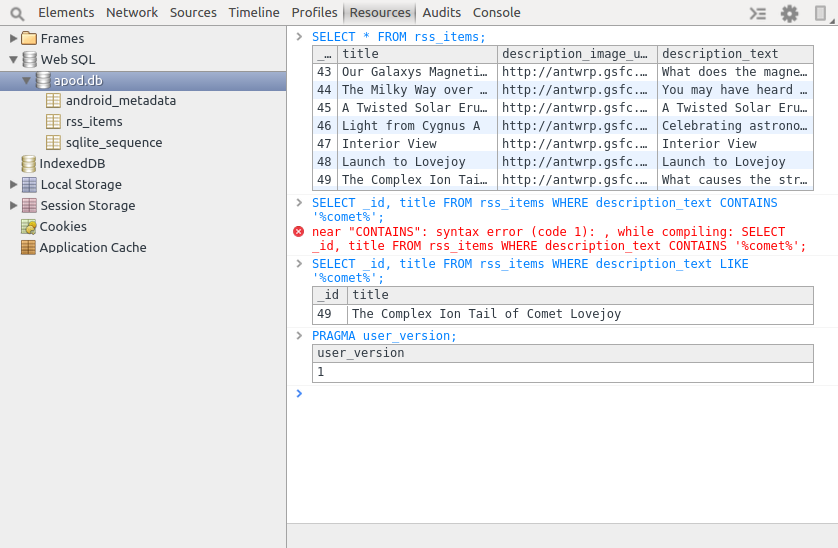
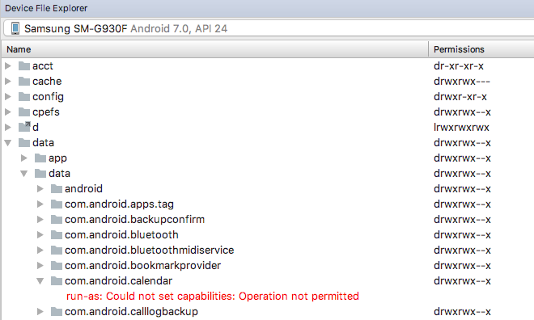

slidenumbers: true
autoscale: true
build-lists: true


——-

# Что такое legacy?

* То, что написано не нами

——-

# Что такое legacy?

~~То, что написано не нами~~

——-

# Что такое legacy?

~~То, что написано не нами~~
Архитектуры нет или плохая архитектура


——-

# Что такое legacy?

~~То, что написано не нами~~
Архитектуры нет или плохая архитектура
Слабоструктурированный или слишком запутанный код

——-

# Что такое legacy?

~~То, что написано не нами~~
Архитектуры нет или плохая архитектура
Слабоструктурированный или слишком запутанный код
WTF/ в час превышает 9000

——-

# Как это Legacy мерять?

——-

# Как это Legacy мерять?

$$L$$ = T$$ * $$H [^1]

[^1]: 
 	T - время техдолга в часах, H - часовая ставка разработчика


——-

# Но как определить T?

——-

# Что есть тех.долг? 

* Ошибки и уязвимости
* Проблемы сопровождаемости
* Дублирование кода
* Низкий процент покрытия тестами

———

# Тулы для оценки 

SonarQube

——


———


# Тулы для оценки 


SonarQube
MobSF/Akana/Whatever Security Analysis tool

——


——-


# Тулы для оценки 


SonarQube
MobSF/Akana/Whatever Security Analysis tool
Architecture analysis tool

——

# Тулы для оценки 

SonarQube
MobSF/Akana/Whatever Security Analysis tool
~~Architecture analysis tool~~

——

# Что такое архитектура? 

Архитектура - это набор структур, состоящих из компонентов и связей между ними, а также свойств одних и вторых, определяющих свойства системы [^2]


[^2]: 
 	Software Architecture in Practice, 3rd Edition, Bass, Clements, Kazman, Addison-Wesley

——-

# Что это к чертям значит? 

* Архитектура - ключ к свойствам системы, которые важны пользователю
* Или владелец продукта думает, что они важны
* То есть плохих или хороших архитектур не бывает, они либо подходят, либо не подходят под требования

——-

# Когда нужно думать про архитектуру? 

* Если вы проверяете технологию, об архитектуре можно не думать
* Если вы пишите скрипт для отсылки почты по списку адресов, об архитектуре можно не думать
* Во всех остальных случаях, про архитектуру надо думать

———

# Какие наши целевые свойства? 

* Быть производительным
* Быть локализуемым
* Работать оффлайн
* Быть тестируемым
* Быть расширяемым

——-

# Тестируемость

* Аргументы и возвращаемые значения должны передаваться явно
* Зависимости должны быть переданы явно
* Зависимости должны быть заменяемы в тестах

——-

# Расширяемость

* Изменения неизбежны
* Сколько стоят реализация изменений:
  - Сколько стоит создание механизма для осуществления изменений?
  - Сколько стоит осуществление изменения с помощью этого механизма? 

——-

# Расширяемость

Для N похожих изменений примерное уравнение равно: 

$$ N $$ * $$ ChangeCost $$ <= $$ MechanismCost $$ + $$ N $$ * ( $$ Change2Cost $$ )

——-

# Какие наши целевые свойства? 

Быть производительным
Быть локализуемым
Работать оффлайн
Быть тестируемым
Быть расширяемым

——-

# Какая архитектура отвечает этим требованиям? 

* Clean architecture

——-


——-


——-

# Какая архитектура отвечает этим требованиям? 

* Clean architecture
* Google Android architecture


——-


——-

# Какая архитектура отвечает этим требованиям? 

* Clean architecture
* Google Android architecture
* VIPER

——-


# Что общего?


——-


# Что общего?


> В строго поделенных на слои системах, слою позволено использовать только слой, расположенный непосредственно под ним [^3]


[^3]: 
 	Software Architecture in Practice, 3rd Edition, Bass, Clements, Kazman, Addison-Wesley

——

# Пример с GreenDao

0. 4 базы данных
1. 30 таблиц
2. 278 классов для доступа к данным
3. 20,000 строк кода для доступа к данным
4. 0% фактического покрытия

——-


——

# Пример из Entity

```java

public class Entity {

	private String name;
	private Long id;

	…

	public String getName();
	…

}

```

——

# Пример - запрос Entity

```java
	@AutoFactory
	public class GetEntityRequest extends SqlRequest {

		@Override
		protected String[] getColumns() {
			return new String[] {
				F + “.” + ID_FIELD + “ AS “ + F_ID_FIELD,
				F + “.” + NAME_FIELD + “ AS “ + F_NAME_FIELD,
				…
				STORAGE + “.” + ID_FIELD + “ AS “ + STORAGE_ID_FIELD,
				…
				SYNC + “.” + ID_FIELD + “ AS “ + SYNC_ID_FIELD,
				…

			}
		}
	}
```


——

# Пример - запрос Entity

```java
	@Override
	public Entity createEntity() {
		if (!cursor.moveToFirst()) {
			return null;
		}
		
		…
		String name = cursor.getString(cursor.getColumnIndex(F_NAME_FIELD));
		…
		return new Entity(id, name, …); 
	}
```

——-


# Пример - запрос Entity

```java, [.highlight: 1,2]
	@AutoFactory
	public class GetEntityRequest extends SqlRequest {
		…
	}
```

——

# Пример - запрос Entity

```java, [.highlight: 1, 2, 6-10]
	@AutoFactory
	public class GetEntityRequest extends SqlRequest {
		…
	}

	@Generated
	public class GetEntityRequestFactory {
		public GetEntityRequest create() {
			return new GetEntityRequest();
		}
	} 
```

——


# Вызов запроса

```java

public class MyEntityActivity extends Activity { 

	@Inject GetEntityRequestFactory requestFactory;

	@Override
	protected void onCreate(Bundle instance) {
		super.onCreate(instance);
		Entity entity = requestFactory.create().createEntity();
		show(entity);
	}
}

```


——

# В чем проблема?

0. Чтение диска на UI 
1. Большое количество кода, чтобы работало
2. Слой представления имеет доступ к данным, затрудняя юнит-тестирование
3. Вы не знаете свою модель данных


——


——-

# Выделение отдельного слоя

1. Отдельный модуль
2. Покрытый на 100% тестами


——-

# А зачем?

1. Вы поймете свою модель
2. Обеспечите ее гарантирование функционирование
3. Защитите от неверного использования

——-


# Как осознать модель данных

——-

# Как осознать модель данных

Stetho [^4]

[^4]:  	http://facebook.github.io/stetho/

——-

# Как осознать модель данных

Stetho [^4]
Db files

[^4]:  	http://facebook.github.io/stetho/

——-

# Как осознать модель данных

Stetho [^4]
or Android file Explorer
Db files
sqldelight [^5]

[^4]:  	http://facebook.github.io/stetho/

[^5]:	https://github.com/square/sqldelight

——-


# Stetho

```java

compile 'com.facebook.stetho:stetho:1.5.0'

```

——-

# Stetho


```java
public class MyApplication extends Application {
  …
  public void onCreate() {
    super.onCreate();
    …
    Stetho.initializeWithDefaults(this);
  }
}
```

——-



——-



——-


#sqldelight

```groovy
buildscript {
  repositories {
    mavenCentral()
  }
  dependencies {
    classpath 'com.squareup.sqldelight:gradle-plugin:0.6.1'
  }
}

apply plugin: 'com.squareup.sqldelight'

```

——-

# sqldelight

```sql
CREATE TABLE entity (
  _id INTEGER NOT NULL PRIMARY KEY AUTOINCREMENT,
  name TEXT NOT NULL
);
```

——-


# sqldelight

```java
public class Entity {

  private Long id;

  private String name;

  public Long getId() { … }
  public String getName() { … }
);
```


——-


# sqldelight

```java

@Table(name = “Entity”)
public class Entity {

  @Column(name = “_id”)
  private Long _id;

  @Column(name = “NAME”)
  private String name;

  public Long getId() { … }
  public String getName() { … }
);
```

——-


# Интеграция в приложение - CIDR!

1. Create unit test
2. Implement
3. Deprecate
3. Replace


——-

# Интеграция в приложение - CIDR!

1. Create unit test

——


# Create unit test

```java
 	@Override
	protected void onCreate(Bundle instance) {
		super.onCreate(instance);
		Entity entity = requestFactory.create().createEntity();
		show(entity);
	}
```

——-


# Create unit test

```java, [.highlight: 4]
 	@Override
	protected void onCreate(Bundle instance) {
		super.onCreate(instance);
		Entity entity = requestFactory.create().createEntity();
		show(entity);
	}
```


——-


# Create unit test

```java, [.highlight: 4,5]
 	@Override
	protected void onCreate(Bundle instance) {
		super.onCreate(instance);
		GetEntityRequest request = requestFactory.create();
		Entity entity = request.createEntity();
		show(entity);
	}
```

——-

# Create unit test

```java
 	
	@VisibleForTesting
	protected Entity loadEntity() {
		return requestFactory.create().createEntity();
	}
```

——-

# Create unit test

```java
 	
	@VisibleForTesting
	protected Observable<Entity> loadEntity() {
		return Single.just(
			requestFactory.create().createEntity()
		);
	}
```

——-

# Create unit test

```java, [.highlight: 4,7-9]
 	@Override
	protected void onCreate(Bundle instance) {
		super.onCreate(instance);
		loadEntity()
			.subscribeOn(Schedulers.io())
			.observeOn(AndroidSchedulers.mainThread());
			.subscribe({entity, throwable} -> {
				show(entity);
			});
		
	}
```

——-

# Create unit test

```java, [.highlight: 4]
 	@Override
	protected void onCreate(Bundle instance) {
		super.onCreate(instance);
		viewModel.loadEntity()
			.subscribeOn(Schedulers.io())
			.observeOn(AndroidSchedulers.mainThread());
			.subscribe({entity, throwable} -> {
				show(entity);
			});
		
	}
```


——-

# Create unit test

```java
 	@Test
	public void shouldLoadEntity() {
		ViewModel viewModel = new ViewModel();
		
		viewModel.loadEntity()
			.subscribe({entity, throwable} -> {
				checkEntity(entity);
			});
		
	}
```

——-

# Create unit test

```java
 	
	public void checkEntity(Entity entity) {
		assertEquals(NAME, entity.getName());
		assertEquals(ID, entity.getId());
		…
	}
```

——

# Интеграция в приложение - CIDR!

1. Create unit test
2. Implement


——-

# Implement

```java
 	
	public interface EntityDAO {
		
		Observable<Entity> loadEntity();
	}
```

——-

# Implement

```java
 	
	public class ViewModel {

		@Inject EntityDao entityDao;
		
		public Observable<Entity> loadEntity() {
			return entityDao.loadEntity();
		}
	}
```


——-

# Implement

```java
 	
	public class GreenDaoEntityDAO implements EntityDAO {
		
		public Observable<Entity> loadEntity() {
			RxDao<DbEntity> rxDao = daoSession.getEntityDao().rx();
			return rxDao.load();
		}
	}
```

——-

# Проблема №1

1. Обьект из базы - это не то, что удобно использовать в представлении 
2. Скорее у вас есть Entity и DbEntity.
3. Что же делать? 

——-

# Конвертеры!

——-

# Конвертеры

```java 	
	public class GreenDaoEntityDAO implements EntityDAO {
		
		public Observable<Entity> loadEntity() {
			RxDao<DbEntity> rxDao = daoSession.getEntityDao().rx();
			return rxDao.load().flatMap(dbEntity -> convert(dbEntity));
		}
		
	}
```

——-

# Конвертеры

```java, [.highlight: 5]
 	
	public class GreenDaoEntityDAO implements EntityDAO {
		
		public Observable<Entity> loadEntity() {
			RxDao<DbEntity> rxDao = daoSession.getEntityDao().rx();
			return rxDao.load().flatMap(dbEntity -> convert(dbEntity));
		}
		
	}
```

——-

# Проблема №2

1. Младшим разработчикам наплевать на эту вашу архитектуру

——-

# Данные из модуля приложения…

```java, [.highlight: 4,6]
 	
	public class GreenDaoEntityDAO implements EntityDAO {
		
		public Observable<Entity> loadEntity() {
			String userId = ApplicationSettings.getUserId();
			RxDao<DbEntity> rxDao = daoSession.getEntityDao().rx();
			return rxDao.load(userId).flatMap(dbEntity -> convert(dbEntity));
		}
		
	}
```

——-

# Понадобилось кому почитать данные из модуля приложения…

* Переносим слой в отдельный модуль
* Покрываем его тестами
* Поставляем бинарно

——

# Интеграция в приложение - CIDR!

1. Create unit test
2. Implement
3. Deprecate

——-

# Deprecate

```java, [.highlight: 1-4,6,8]

/**
 * @deprecated Please, use {@link EntityDao#loadEntity()}
 */
@Deprecated
@AutoFactory
public class GetEntityRequest {
...
}

```

——-

# Интеграция в приложение - CIDR!

1. Create unit test
2. Implement
3. Deprecate
4. Replace


——-

# Финальная статистика


0. 4 базы данных
1. 30 таблиц
2. 84 класса для доступа к данным (было 278)
3. 7400 строк кода вместе с тестами (было 20,000 без тестов)
4. 100% фактического покрытия (было 0%)


——-


——-

# Какие целевые свойства достигнуты? 

* Быть производительным :white_check_mark:
* Быть локализуемым
* Работать оффлайн :white_check_mark:
* Быть тестируемым :white_check_mark:
* Быть расширяемым :white_check_mark:

——-


# Где еще можно использовать такой подход? 

* Переделывая взаимодействие с сетью
* Переходя на MVVM
* Вообще, вводя любой новый слой


——-

# Где этот подход не помогает? 

* С секьюрити
* С тулами
* С любым межкомпонентным code 

---

# О докладчике

* Владимир Иванов - ведуший разработчик в EPAM
* Больше 6 лет разработки под Android
* Больше 15 опубликованных приложений 
* Широкий кругозор в мобильных технологиях

——-

# QA


